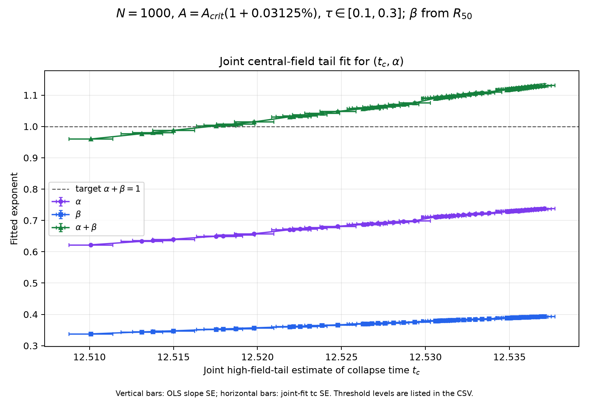
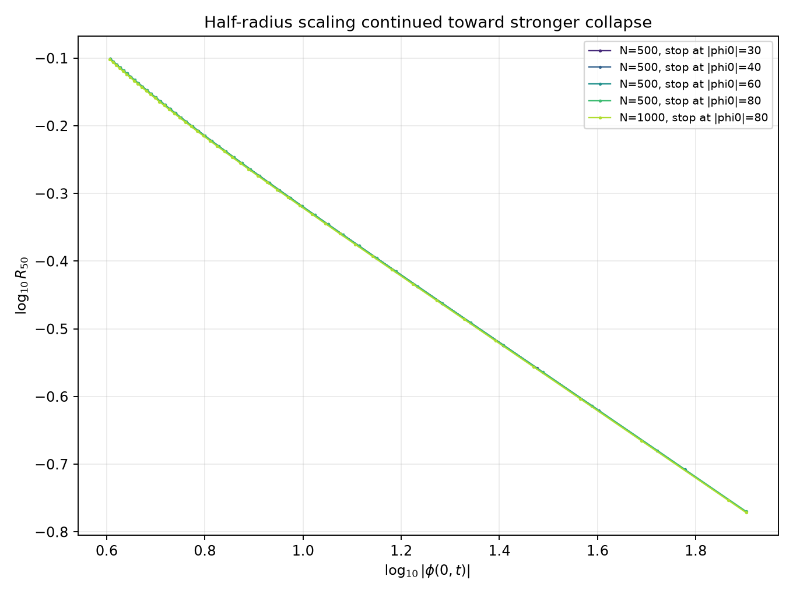
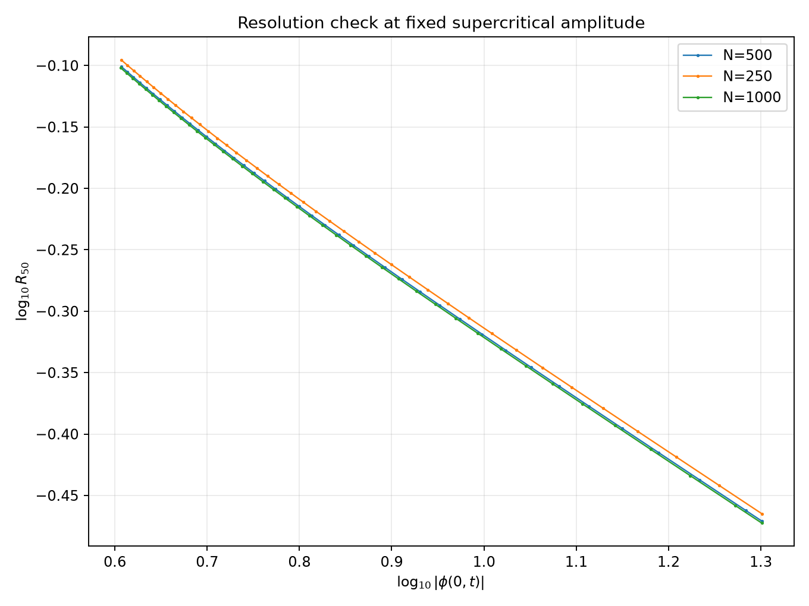

# Half-central-field radius study

## Goal and definition

This is a standalone critical-collapse study using a field-profile width rather
than an energy-weighted radius. At each time, the core half-radius is

```text
R50(t) = first r > 0 where abs(phi(r,t)) <= 0.5*abs(phi(0,t))
```

The first crossing is linearly interpolated between adjacent radial grid
points. The absolute value makes the definition insensitive to the field's
sign. The CSVs contain `R50` and its square, not the previous signed-energy
`<r^2>` radius.

## Independent simulation setup

`study.py` contains its own solver and threshold search. It does not import the
old Module 4 script or anything from `beta_collapse_study`; all generated
outputs are written to this folder's `results/` directory. The radial PDE,
Gaussian initial condition, stretched grid, sponge, and RK4 stepping match the
Module 4 setup: `N=500`, `Rmax=25`, stretch 5, `R0=2`, and `pi(r,0)=0` for the
threshold search. The threshold search is rerun from scratch each time.

The critical amplitude is operationally defined as the finite-horizon boundary
between runs that do and do not reach `|phi(0,t)|=12` by `t=100`. The bisection
uses tolerance `1e-8`. It found

| Quantity | Result |
|---|---:|
| Non-collapsing lower edge | `1.202609697729` |
| Collapsing upper edge | `1.202609704062` |
| Midpoint `Acrit` estimate | `1.202609700896` |

The midpoint and both bracket-edge time series are saved. This agrees with the
previous finite-horizon threshold estimate, but remains a numerical,
finite-time definition—not proof of a continuum critical solution.

## Supercritical runs and fit method

Three `N=500` runs start `0.01%`, `0.05%`, and `0.1%` above the bracket
midpoint and stop when `|phi(0,t)|=20`. The closest run is continued to
`|phi(0,t)|=30, 40, 60, 80`; a second `N=1000` run reaches 80. At fixed
amplitude, `N=250, 500, 1000` runs are compared through the cutoff 20.

The collapse time and central-field exponent are jointly fitted on the final
40 high-field samples (`|phi(0,t)| >= 4`) using
`|phi(0,t)| ~ (tc-t)^(-alpha)`. The radius fit is

```text
log10(R50) = beta*log10(tc - t) + C
```

Fits are reported for remaining-time windows `0.1–0.3`, `0.2–0.6`,
`0.4–1.0`, and `0.8–1.6`; fit samples also require `|phi(0,t)| >= 4` to
exclude the early oscillatory stage. A separate direct fit of `log(R50)` versus
`log(|phi(0,t)|)` estimates `q=beta/alpha` without needing `tc`.

## Earlier exploratory results (retained as context)

The broad N=500 and N=1000 runs below document the original exploration. The
focused paired α–β analysis in the next section now uses only `N >= 1000` and
the near-collapse interval `0.1 <= t_c-t <= 0.3`.

| Excess | `A0` | Time to `|phi0|=20` | Joint `tc` | Joint `alpha` | Joint `beta` | Direct `q=beta/alpha` |
|---:|---:|---:|---:|---:|---:|---:|
| 0.01% | 1.202729962 | 15.2032 | 15.2560 | 0.7529 | 0.4217 | 0.5299 |
| 0.05% | 1.203211006 | 11.8179 | 11.8684 | 0.7230 | 0.4118 | 0.5339 |
| 0.10% | 1.203812311 | 11.4486 | 11.5017 | 0.7654 | 0.4271 | 0.5307 |

The directly measured width shrinks consistently as the central field grows.
The direct width/field exponent is stable across the three amplitudes
(`q=0.5299–0.5339`, fit `R²` about `0.999`). The reported time exponents use
only the joint high-field-tail estimate of `tc` and `alpha`; changing the fit
window still changes the measured `beta`.

Continuation toward `|phi(0)|=80` changes the joint fit gradually: at the
cutoff, `N=500` gives tail `alpha=0.8530`, `beta=0.4439`; `N=1000` gives
`alpha=0.8548`, `beta=0.4438`. Their direct ratios are `q=0.5115` and `0.5098`.
There is also fit-window sensitivity; `0.8–1.6` has no samples after applying
`|phi(0)| >= 4` for these runs. A high `R²` alone does not remove this
dependence. The robust observation is a
contracting, resolved half-radius and direct width/field scaling near
`q=0.51–0.53`, not a definitive universal beta.

Resolution checks support the width measurement. At `|phi(0)|=20`, `R50` is
`0.34289`, `0.33819`, and `0.33690` for `N=250, 500, 1000`. At the more
contracted `|phi(0)|=80` cutoff, `N=500` and `N=1000` give `R50=0.169824` and
`0.169165` (about 0.4% apart).

## Earlier single-amplitude shared-`tc` baseline (historical)

Yes: the notes call the central-field blowup exponent `alpha`. In their
self-similar form, the central field and core radius scale as

`|phi(0,t)| ~ C_phi (tc-t)^(-alpha)` and
`R_core(t) ~ C_R (tc-t)^beta`.

Their log-log forms are `log10|phi(0,t)| = -alpha*log10(tc-t) + log10(C_phi)`
and `log10(R_core) = beta*log10(tc-t) + log10(C_R)`.

So `alpha` is measured directly from the central-field magnitude. The
multiplicative radius normalization is `C_R`, **not** `alpha`; earlier
comparison outputs called that radius prefactor `alpha`, which was misleading.
The regenerated CSVs now use `alpha_central` and `C_R` explicitly.

In the earlier single-run `alpha + beta` check, both slopes use the same `tc`
and the same `0.1 <= tc-t <= 0.3` interval, with `|phi(0,t)| >= 4`. Only runs
with `N >= 1000` are retained; this leaves the `N=1000`, `+0.01%` run. The
collapse time and tail exponent are jointly fitted from the high-field central
field; the same `tc` is used for both radius definitions. The notes' proposed
relation is `alpha + beta = 1`. The older fixed-`alpha=1` estimator and its
outputs have been retired and are no longer included in regenerated fits.

| Run | `tc` method | Shared `tc` | `alpha` | `beta` half-radius | `alpha+beta` half | `beta` Gaussian | `alpha+beta` Gaussian |
|---|---|---:|---:|---:|---:|---:|---:|
| N=1000, +0.01% | joint `tc,alpha` | 15.2849 | 0.8493 | 0.4420 | 1.2914 | 0.4347 | 1.2840 |

For this one high-resolution run and narrow interval, the sum remains above
1. The result does not confirm the notes' `alpha+beta=1` relation. It was a
single-run baseline, not the current multi-amplitude threshold search.

These values are retained as a baseline, not the current multi-amplitude
search. The paired CSV remains at
[`shared_tc_alpha_comparison.csv`](../../shared_tc_alpha_comparison.csv).
Current plots and fits for all threshold choices are in the
[`alpha_beta_scaling` gallery](results/alpha_beta_scaling/README.md).

The full sampled trajectories and fit tables—including continuation and
resolution fits—are in [results](results/).
Important figures:



## Threshold and collapse-time sensitivity search (N=1000)

The new paired search excludes every `N<1000` fit and varies the central-field
crossing used to estimate `tc` (`|phi(0)|=20,30,...,80`, with one-unit
refinement near `alpha+beta=1`). It scans 22 amplitudes with usable crossings
between `+0.01%` and `+0.1%` of the reference `Acrit`; a further `+0.02875%`
trajectory is retained but did not reach even the first `|phi(0)|=20` level by
`t=100`. The fit window remains `0.1 <= tc-t <= 0.3`. Collapse time is
estimated only by the joint high-field-tail fit, and near-collapse `alpha` is
freely fitted.

The finite-horizon outcomes in this amplitude band are non-monotone: the
`+0.02875%` run does not reach `|phi(0)|=12` by `t=100`, while runs at lower
offsets and again from `+0.03%` upward do. A narrow N=1000 bisection brackets
one **local** outcome transition near `+0.02999054%` relative to the N=500
reference; it is not a global critical amplitude. See the shared
[scaling-diagnostics report](../../scaling_diagnostics/report.md) and
[outcome map](../../scaling_diagnostics/results/n1000_finite_horizon_outcomes.png).

All collapse trajectories use `N=1000`, but the adopted `Acrit=1.202609700896`
was bracketed previously at `N=500`; this scan does not re-bracket it at
`N=1000`. The small percentage offsets are relative to that existing reference.

At a matched `+0.03125%`, joint-tail, `|phi(0)|=26` point, both radius methods
share `tc=12.51870` and `alpha=0.65358`. The half-radius fit gives
`beta=0.35489` and `alpha+beta=1.00847 ± 0.00231`; the Gaussian-radius fit gives
`beta=0.34446` and `alpha+beta=0.99804 ± 0.00243`. Nearby crossing levels move
the sum by around one percent, so the apparent agreement is a promising
search result, not a universal-exponent claim. The quoted uncertainties are
fit errors only; threshold, fit-window, amplitude, and resolution effects are
not folded into them. Because the scan was refined after looking for a sum of
1, the closest point is also subject to selection bias.

The per-amplitude plots, full fit table, trajectory manifest, and rerun command
are documented in the [local results gallery](results/alpha_beta_scaling/README.md).





## Limitations

`R50` is a profile-width observable, not a moment of the whole energy density.
It is most useful while a coherent central core is present; oscillatory
low-amplitude stages can make a half-height crossing jump, so the fits exclude
the region `|phi(0,t)|<4`. The CSVs store the scalar diagnostics needed to
re-fit `R50` scaling, not the full radial field profiles; a different profile
observable would require saving those profiles in a future run.
