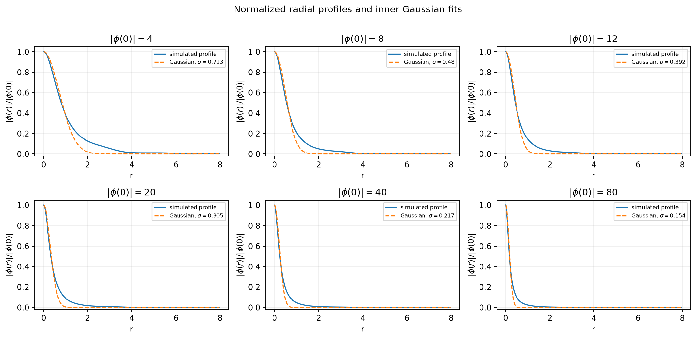
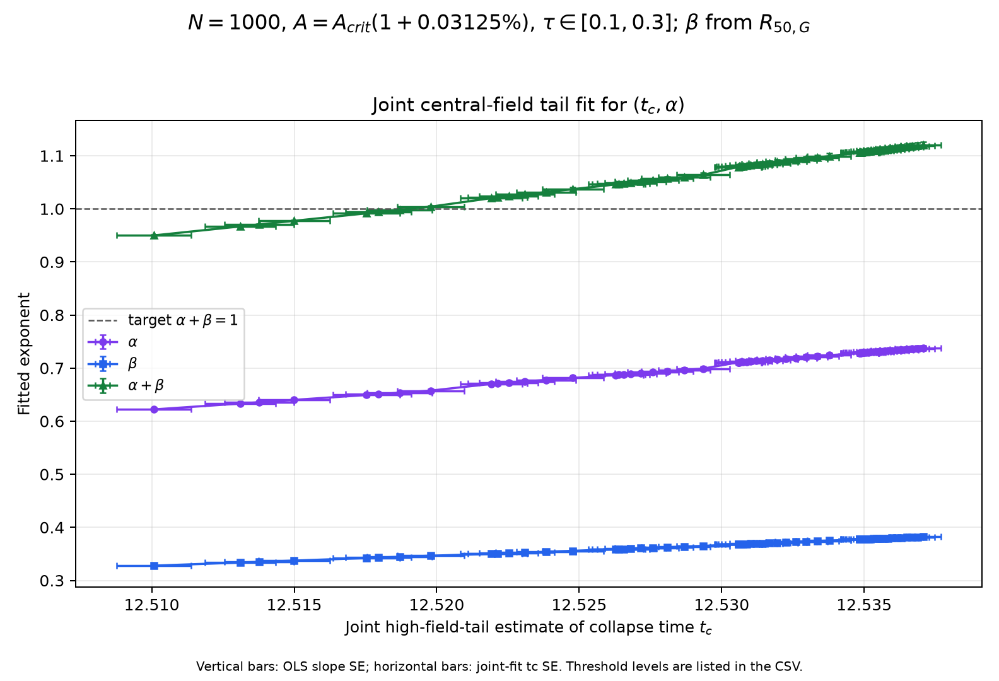
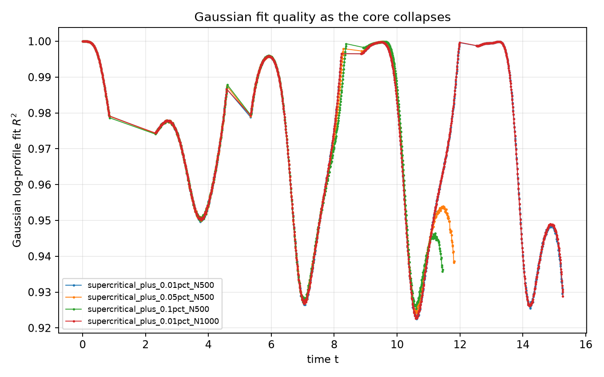

# Gaussian-profile estimate of the collapsing core width

## What is being assumed

The initial condition is Gaussian, but the radius is **not held fixed**. At
each time the code fits a new width `sigma(t)` and assumes that the normalized
inner profile approximately keeps its Gaussian shape:

$$
\frac{|\phi(r,t)|}{|\phi(0,t)|}\approx
\exp\!\left(-\frac{r^2}{2\sigma(t)^2}\right).
$$

The fit is a straight-line fit of `ln(|phi(r,t)|/|phi(0,t)|)` versus `r^2`,
constrained to pass through zero as required by the normalization at the
center. To make this a *core* fit rather than letting the distant wave tail set
the scale, it uses radii `r <= 8` where the normalized field is between 0.30
and 0.90, stopping at the first outward crossing below 0.30. If the fitted
slope is `m`, then `sigma = sqrt(-1/(2 m))`.

The core radius reported in the plots is the Gaussian-implied half-height
radius. Since a Gaussian falls to half its central value at
`r = sqrt(2 ln 2) sigma`,

$$
R_{50,G}(t)=\sqrt{2\ln 2}\,\sigma(t).
$$

Thus `sigma` is the fitted Gaussian width, while `R50,G` is directly
comparable to a radius defined by the field's half-height crossing. The
initial-condition check recovers `sigma(0)=R0=2` and
`R50,G(0)=2.35482` with log-profile `R^2=1`.

## Independent run and parameters

`study.py` contains its own stretched radial grid, sponge, 3-D spherical
Laplacian, RK4 evolution, profile fitting, critical search, and plotting. It
does not import either neighboring study or load their CSVs. The default
supercritical amplitudes use the already established finite-horizon reference
`Acrit = 1.202609700896` for N=500; `--search-critical` reruns the threshold
bisection locally if a fresh bracket is wanted. The copied number is only a
default parameter, not a runtime dependency.

The simulation uses `Rmax=25`, `R0=2`, stretch 5, zero initial velocity, and
the Module 4 potential `V(phi)=phi^2/2-phi^4/4`. Runs are 0.01%, 0.05%, and
0.1% above `Acrit`; the closest supercritical run is continued to
`|phi(0)|=80`, then repeated at N=1000. The two other N=500 runs stop at 20.
The sampled trajectories include `sigma_gaussian`, `r50_gaussian`, the
log-profile fit quality, and the fit-point count.

## Earlier broader fit study (historical context)

The following exploratory results retain their original resolutions and fit
windows for context. The focused shared α–β comparison below now filters to
`N >= 1000` and `0.1 <= tc-t <= 0.3`.

For each run, the code jointly estimates `tc` and the central-field exponent
from the high-field tail, then fits the same remaining-time windows used in
the half-radius study. The plotted axes are
`log10(tc-t)` and `log10(R50,G)`, with data restricted to
`|phi(0,t)| >= 4`. The table shows the central window
`0.2 <= tc-t <= 0.6`.

| Run | `A` | Stop field | Joint `alpha` | Joint `beta` | Direct `q=beta/alpha` | Median Gaussian-shape `R^2` |
|---|---:|---:|---:|---:|---:|---:|
| N=500, +0.01% | 1.202729962 | 80 | 0.8530 | 0.4417 | 0.5037 | 0.9465 |
| N=500, +0.05% | 1.203211006 | 20 | 0.7230 | 0.4077 | 0.5241 | 0.9514 |
| N=500, +0.10% | 1.203812311 | 20 | 0.7654 | 0.4264 | 0.5250 | 0.9447 |
| N=1000, +0.01% | 1.202729962 | 80 | 0.8548 | 0.4404 | 0.5022 | 0.9469 |

All central-window radius fits have `R^2 >= 0.9995`. The direct width-versus
central-field exponent `q` is about 0.50–0.53. For the closest run continued
to 80, changing from N=500 to N=1000 moves the Gaussian half-radius at the
cutoff from `0.18176` to `0.18099` (about 0.43%), and changes the two beta
estimates only slightly. This is encouraging resolution agreement for this
observable.

`beta` is not one unique number yet: even with nearly straight radius fits,
the fit window matters. The reported values use the joint high-field-tail
estimate of `tc` and `alpha`; there are no accepted points in `0.8–1.6` for
these runs. These are fit-window uncertainties, not a failure of the log-log
axes or a sign that the radius expands. The older fixed-`alpha=1` estimator
has been retired and is excluded from regenerated fit tables and plots.

## Is the Gaussian shape a good approximation?

It is a useful *inner-core* approximation over the selected 30–90% amplitude
band, but it does not describe the entire radial profile. Across the
`|phi(0)| >= 4` samples, the median constrained log-profile `R^2` is about
0.94–0.95 for the four runs. The profile overlays show a close match near the
core, with visible differences farther out in the tail. As the core narrows,
the fitted half-radius decreases from about `0.839` at `|phi(0)|=4` to
`0.182` at 80:

| `|phi(0)|` | fitted `sigma` | Gaussian half-radius `R50,G` | log-profile `R^2` |
|---:|---:|---:|---:|
| 4 | 0.7129 | 0.8394 | 0.9478 |
| 8 | 0.4797 | 0.5648 | 0.9442 |
| 12 | 0.3916 | 0.4611 | 0.9407 |
| 20 | 0.3053 | 0.3595 | 0.9372 |
| 40 | 0.2172 | 0.2557 | 0.9327 |
| 80 | 0.1544 | 0.1818 | 0.9296 |

As a cross-check, the separate half-height-crossing study gives `R50=0.16982`
at N=500 and `0.16917` at N=1000 at the same `|phi(0)|=80` cutoff. The
Gaussian-implied value is roughly 7% larger. That systematic difference is
reasonable evidence that the profile is not exactly Gaussian, even though its
core is well fit. The fitted radius therefore depends somewhat on which part
of the profile is used to define “Gaussian width”; the 30–90% band is stated
explicitly so this choice can be varied in a later sensitivity study.

The useful conclusion is that a time-dependent Gaussian core width produces a
clear contraction and a well-resolved log-log scaling near collapse. It is a
credible compact parameterization of the inner core, not proof that the whole
oscillon profile remains Gaussian or that the measured beta is universal.

## Earlier single-amplitude shared-`tc` baseline (historical)

In the notes, `alpha` is the exponent of the central-field magnitude, not the
radius prefactor. The fitted laws are

`|phi(0,t)| ~ C_phi (tc-t)^(-alpha)` and
`R50,G(t) ~ C_R (tc-t)^beta`.

The central-field exponent is fitted from `|phi(0,t)|` directly; the Gaussian
radius slope gives `beta`. The vertical intercept of the radius fit is
`log10(C_R)`, so its multiplicative normalization is called `C_R` in the
regenerated CSVs. A previous version mislabeled this radius normalization as
`alpha`; that label was incorrect.

The earlier single-run `alpha+beta` comparison retained only `N >= 1000` and
the `0.1 <= tc-t <= 0.3` interval, with the same central-field-derived `tc`
and central magnitude cutoff `|phi(0,t)| >= 4`. In that earlier matched data
this leaves the `N=1000`, +0.01% run. That exact `tc` is used for both the
directly measured half-radius and this Gaussian-implied radius. The notes
predict `alpha+beta=1`.

For the retained N=1000 run, the comparison is:

| `tc` method | Shared `tc` | Central-field `alpha` | Gaussian `beta` | `alpha+beta` | Radius-fit `R^2` |
|---|---:|---:|---:|---:|---:|
| joint `tc,alpha` | 15.2849 | 0.8493 | 0.4347 | 1.2840 | 0.99999 |

The measured sum remains above 1 in this run. This earlier one-run baseline
does not confirm `alpha+beta=1`.

These values are retained as a baseline, not the current multi-amplitude
search. The fit table is [`shared_tc_alpha_fits.csv`](results/shared_tc_alpha_fits.csv)
and the paired CSV remains in the parent folder
([comparison table](../shared_tc_alpha_comparison.csv)). Current plots and fits
for the threshold scan are in this study's
[`results/alpha_beta_scaling`](results/alpha_beta_scaling/README.md) gallery.

## Figures and data





## Threshold and collapse-time sensitivity search (N=1000)

The current paired search excludes every `N<1000` fit and varies the
central-field crossing used to estimate `tc` (`|phi(0)|=20,30,...,80`, with
one-unit refinement near `alpha+beta=1`). It scans 22 amplitudes with usable
crossings between `+0.01%` and `+0.1%` of the adopted `Acrit` reference. A
further `+0.02875%` trajectory is retained but did not reach even
`|phi(0)|=20` by `t=100`. The fit window is `0.1 <= tc-t <= 0.3`. Collapse
time is estimated only by the joint high-field-tail fit, and the plotted
near-collapse `alpha` is freely fitted.

At the matched `+0.03125%`, joint-tail, `|phi(0)|=26` point, both radius
methods share `tc=12.51870` and `alpha=0.65358`. This Gaussian-radius fit gives
`beta=0.34446` and `alpha+beta=0.99804 ± 0.00243`; the corresponding
half-radius sum is `1.00847 ± 0.00231`. Nearby threshold crossings move the
sum by around one percent. The near-one values are suggestive, not a settled
scaling law: the scan was refined in response to the target relation, the
radius definition matters, and the quoted fit errors do not include
threshold/window/amplitude/resolution systematics.

The adopted `Acrit=1.202609700896` reference was previously bracketed with
`N=500`; the collapse trajectories and exponent fits here are all `N=1000`,
but this current scan does not re-bracket `Acrit` at `N=1000`. This limits how
literally to interpret the small percentage offsets.

Per-amplitude plots, raw run links, full fit data, manifests, and rerun command
are in the [local results gallery](results/alpha_beta_scaling/README.md).



The time-series CSVs are `supercritical_plus_*.csv`; the log-log fit table is
`beta_fit_sensitivity.csv`, the direct `q` and Gaussian-shape summaries are in
`width_vs_central_field.csv`, and selected raw profile samples are in
`gaussian_profile_snapshots.csv`. Regenerate figures/fits without rerunning
the simulations with:

```bash
python3 module4/Scale_invariance/gaussian_profile/study.py --analyze-existing
```

Run the shared-collapse-time coefficient comparison with:

```bash
python3 module4/Scale_invariance/shared_tc_alpha.py
```
