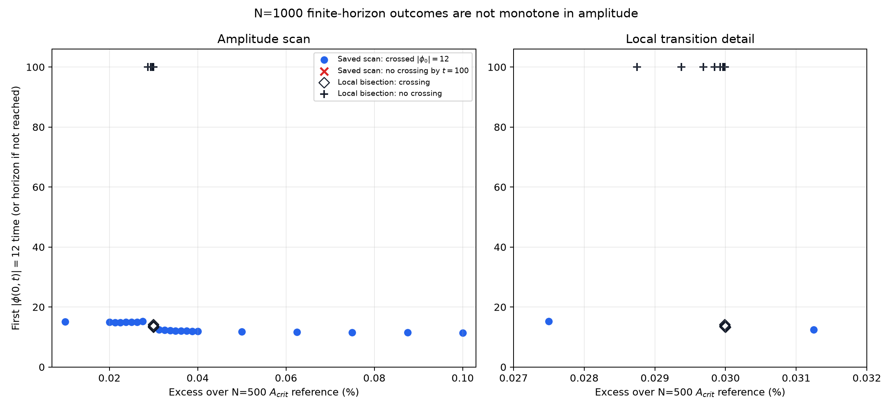
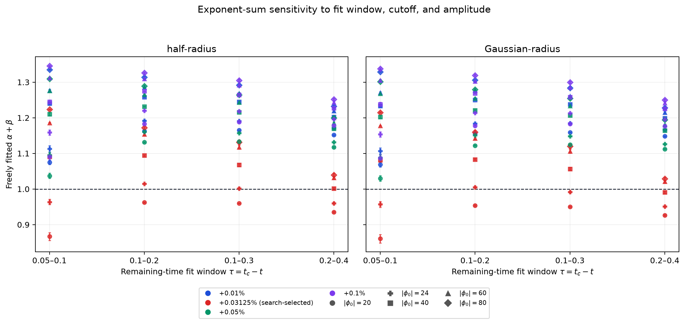

# What the near-collapse scaling fits do—and do not—show

## Short answer

The N=1000 runs do **not** establish one global critical amplitude: the
finite-horizon result changes non-monotonically across a narrow interval.
Likewise, the fitted `alpha + beta` can be close to 1 for a particular
amplitude, field cutoff, radius definition, and time window, but moves
noticeably when those choices change. The near-one point is exploratory because
the amplitude and threshold scan was refined after looking for that target.

Only the high-field joint estimate of collapse time and tail exponent is used
here. The fixed-`alpha=1` method and its plots are retired; no alpha value is
assumed in these fits.

## What defines the reference `Acrit`

The amplitude used to label the supercritical offsets is the N=500 finite-time
reference `Acrit = 1.202609700895846`. It was obtained by bisecting the boundary
between runs that do and do not reach `|phi(0,t)| = 12` by `t = 100`, to an
amplitude tolerance of `1e-8`. The setup was `Rmax=25`, `R0=2`, stretched-grid
parameter 5, CFL 0.4, sponge fraction 0.8, sponge strength 7, sponge power 3,
and zero initial velocity. This is an operational finite-horizon threshold at
N=500, not a proof of a continuum critical solution and not an N=1000
re-bracketing.

| N=500 bisection classification | Amplitude |
|---|---:|
| Lower edge (non-crossing by the horizon) | `1.202609697729` |
| Upper edge (crossing by the horizon) | `1.202609704062` |
| Midpoint used as `Acrit` reference | `1.202609700896` |

All offsets in the N=1000 sweep are relative to that N=500 reference. For
example, `+0.03%` means `A = Acrit_N500 * (1 + 0.0003)`; it does not mean 0.03
above the amplitude.

## The N=1000 outcome is non-monotone

Every tested offset through `+0.0275%` in the N=1000 saved scan reaches
`|phi(0,t)|=12` by `t=100`. The `+0.02875%` trajectory instead peaks at only
`|phi(0)| = 3.696` over the full horizon. Runs at `+0.03%` and above reach the
cutoff again. Thus a lower tested amplitude collapses by this criterion while
a slightly higher one does not; neither outcome supports a single monotone
global threshold over this band.

An additional recorded-step bisection only brackets a **local** transition
near `+0.02999054%` relative to the N=500 reference:

| N=1000 local finite-horizon result | Amplitude `A` | Excess from N=500 reference |
|---|---:|---:|
| Last tested non-crossing side | `1.202970366364` | `+0.029990234%` |
| First tested crossing side | `1.202970373704` | `+0.029990845%` |
| Midpoint (local transition estimate) | `1.202970370034` | `+0.029990540%` |
| Bisection width in `A` | `7.34e-9` | — |

The classification remains “reached `|phi(0,t)|=12` by `t=100`” versus “did
not reach it,” using the same run settings. The bisection endpoints are
verified classifications and bracket a local transition under the bisection's
assumption of a monotone outcome within that tiny interval; they are **not** a
global `Acrit`, because lower amplitudes in
the saved scan also cross the cutoff. A missed crossing by `t=100` also does
not prove the run would never collapse later. The outcome map and every saved
trial are in
[`results/n1000_finite_horizon_outcomes.png`](results/n1000_finite_horizon_outcomes.png)
and
[`results/n1000_finite_horizon_outcomes.csv`](results/n1000_finite_horizon_outcomes.csv).



## How `tc`, `alpha`, and `beta` were fitted

For each selected high-field level, the trajectory is cut at its first
crossing. The final up-to-40 samples in that truncated tail with
`|phi(0,t)| >= 4` are jointly fitted to
`|phi(0,t)| ~ (tc - t)^(-alpha_tail)` to estimate `tc` and the tail slope.
Then, with that same `tc`, the notes' exponents are freely fitted over a chosen
`tau = tc - t` window:

- `|phi(0,t)| ~ (tc - t)^(-alpha)` gives the central-field exponent `alpha`.
- `R50 ~ (tc - t)^beta` or `R50,G ~ (tc - t)^beta` gives `beta` for the
  half-height or Gaussian-implied radius.

Thus the method does not force `alpha=1`. It also does not estimate `tc` from
one threshold time alone: it uses the high-field samples up to each selected
crossing and jointly fits `tc` and `alpha_tail`.

## What the fit sensitivity says

The cached-trajectory audit includes four time windows, all with
`tau <= 0.4`: `[0.05,0.1]`, `[0.1,0.2]`, `[0.1,0.3]`, and `[0.2,0.4]`. It uses
cutoffs `|phi(0)| = 20, 24, 40, 60, 80`, both radius definitions, and N=1000
only. The `+0.01%`, `+0.05%`, and `+0.1%` offsets are the original coarse
amplitude anchors; `+0.03125%` was added by the adaptive near-one search.

At the search-selected `+0.03125%` amplitude and cutoff 24, the default
`tau=[0.1,0.3]` results are:

| Radius definition | Shared `tc` | `alpha` | `beta` | `alpha+beta` (fit SE only) |
|---|---:|---:|---:|---:|
| Half-height `R50` | `12.51753` | `0.64932` | `0.35256` | `1.00188 ± 0.00209` |
| Gaussian `R50,G` | `12.51753` | `0.64932` | `0.34221` | `0.99152 ± 0.00222` |

At the same amplitude and cutoff, changing the window to `[0.2,0.4]` moves the
sums to `0.96018` and `0.95098`, respectively. At cutoff 26 and the default
window, the sums are `1.00847` (half-height) and `0.99804` (Gaussian). These
nearby choices alone shift the answer by amounts much larger than the listed
OLS fit errors.

Across the five cutoffs at the default `[0.1,0.3]` window, the three original
coarse amplitude anchors give sums from `1.1331` to `1.3053` for `R50`, and
`1.1248` to `1.2994` for `R50,G`. At the search-selected `+0.03125%` amplitude,
the corresponding cutoff ranges are `0.9599–1.1316` and `0.9500–1.1201`.
The apparent relation therefore is not stable under reasonable fit choices.
The complete 160-row table and comparison figure are
[`results/fit_window_sensitivity_N1000.csv`](results/fit_window_sensitivity_N1000.csv)
and
[`results/fit_window_sensitivity_N1000.png`](results/fit_window_sensitivity_N1000.png).



The uncertainties shown are regression errors conditional on the selected
trajectory, cutoff, `tc` fit, and time window. They do not include uncertainty
from resolution, finite horizon, amplitude selection, cutoff choice, or
profile definition. In particular, the `+0.03125%` point was selected by
searching for a sum near 1, so it is not an independent test of the relation.

## Dimensional-scaling check against the notes

The notes (pp. 4–5 of `Oscillon_dynamics_notes_20260917.pdf`) propose
`alpha + beta = 1` from a scaling statement about `nabla(phi)`. For the
high-field equation used in this study,
`d_t^2(phi) - laplacian(phi) - phi^3 ~= 0`, the direct single-scale ansatz is
`phi ~ tau^(-alpha) F(r/tau^beta)`. Its three terms scale as:

```text
d_t^2(phi)       ~ tau^(-alpha - 2)
laplacian(phi)    ~ tau^(-alpha - 2 beta)
phi^3             ~ tau^(-3 alpha)
```

If all three terms remain leading and balance without a cancellation, matching
these powers gives `beta=1` and `alpha=1`, hence `alpha+beta=2`, not 1. There
is also a dimensional issue in the notes' step: with the stated field
dimension `[phi]=L^-1`, a spatial derivative has dimension
`[nabla(phi)]=L^-2`, not `L^-1`. So the relation `alpha+beta=1` does not follow
from that dimensional statement alone.

This is a conditional scaling check, not a proof that another asymptotic
balance is impossible. A special profile, cancellation, or subleading term
could change which terms balance; that needs to be derived or tested directly.
The present finite-resolution fits are not enough to establish a universal
exponent law.

## Bottom line and next useful test

There is clear core contraction and the high-field fits are numerically
straight over the chosen windows, but a high `R^2` and a near-one sum do not
settle the scaling law. The amplitude outcomes are non-monotone under the
finite-horizon criterion, and exponent sums depend on amplitude, cutoff,
window, and radius definition. The strongest next check is to map the outcome
class at N=1000 more broadly and at longer horizons, then repeat the exponent
fits at a resolution where the outcome boundary and fitted exponents are
stable—without selecting amplitudes based on whether the sum is near 1.
